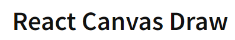

<h1 align="center">InPainting Widget</h1>
<h3 align="center">The application provides a user-friendly interface where users can upload images and get a mask out of it by drawing on the image</h3>
<h4 align="center">Visit the website at https://inpainting-widget-byvd.vercel.app/</h4>


<h2 align="left">Tech Stack and Tools :</h2>

<a href="https://reactjs.org/" target="_blank" rel="noreferrer">  </a>
<a href="https://tailwindcss.com/" target="_blank" rel="noreferrer">  </a>
<a href="https://developer.mozilla.org/en-US/docs/Web/JavaScript" target="_blank" rel="noreferrer">  </a>
<a href="" target="_blank" rel="noreferrer">  </a>
<a href="https://git-scm.com/" target="_blank" rel="noreferrer">  </a>

<h2 align="left">Features :</h2>

- Utilized **react-canvas-draw** library for drawing functionality.

<h3 align="left">Image Upload : </h3> 

- Users can upload an image to the application.

- The uploaded image is displayed on a canvas for further processing.


<h3 align="left">Mask Drawing : </h3>

- Users can draw on the uploaded image using a brush to create a mask.

- The drawing is intuitive and user-friendly.


<h3 align="left">Real-time Mask Generation :</h3>

- A real-time preview of the mask is displayed alongside the uploaded image.

- Users can instantly see the generated mask as they draw.
  

<h3 align="left">Brush Controls :</h3>

- Users can adjust the **brush size** and also choose **brush colour** to suit their needs.

- Includes a feature to **clear the canvas** for starting a new drawing.

  
<h3 align="left">Save and Download :</h3>

- The **uploaded image** and the **generated mask** can be saved.
  
- Users can **download** both the original image and the generated mask for local use.


<h2 align="left">Challenges and Solutions</h2>

<h4>Challenge :</h4>
<p> Generating a real-time mask independent of the brush color posed a significant technical challenge.</p>

<h4>Solution :</h4>
  
<p> To overcome this, I analyzed the workflow of the react-canvas-draw library and its <CanvasDraw /> component in depth. By leveraging the useRef() hook and implementing advanced filtering techniques, I successfully generated the mask, ensuring it remains unaffected by variations in brush color. </p>


<h2 align="left">Website Video</h2>

- Presented here is a brief overview video of the application, providing insights into its some of the functionalities and design.

- Please take a moment to watch and gain an understanding of the platform's offerings.


https://github.com/user-attachments/assets/e810a006-c5f9-4e83-aeb0-f21a50298158


<h2 align="left">Installation</h2>
<h3 align="center">To get started with this project, clone the repository or download the zip file.</h3>
<h4 align="center">Install the necessary dependencies</h4>

```bash
# Clone the repository
git clone https://github.com/Rupesh2728/Inpainting-Widget.git

# Navigate to the project directory
cd Inpainting-Widget-main

# Install dependencies
npm install or npm install --legacy-peer-deps 

# Run the Server
npm run dev

```


<h2 align="left">Contact Us</h2>

- 📫 You can to reach us by mailing to **rupesh.p21@iiits.in** or **rupeshprofessional2728@gmail.com**

- 👨‍💻 Project is available at [https://github.com/Rupesh2728/Inpainting-Widget.git]
  


